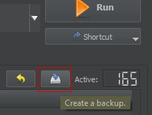

# Final Steps 

---

This section ensures that your load order is correct for the guide by overwriting
MO2's `loadorder.txt` file. It's fine if you skipped any number of mods in the guide;
this process will still work.

Click the  button at the top of MO2 and select <button>Open Profile Folder</button>. Double-click `loadorder.txt` to open it in your text editor of choice and **replace** any existing contents with the following:

```txt title="C:\Users<YOUR USERNAME>\AppData\Local\ModOrganizer\TTW\profiles\Default\loadorder.txt"
# This file was automatically generated by Mod Organizer.
# ╔═════════════ Wasteland Survival Guide Load Order ══════════════╗
# ║ This is a file for MO2 to parse automatically; you don't need  ║
# ║ to read or edit it. Many listed mods are NOT part of the guide ║
# ║ and are only here as contingencies. Please ignore them!        ║
# ╚════════════════════════════════════════════════════════════════╝
FalloutNV.esm
DeadMoney.esm
HonestHearts.esm
OldWorldBlues.esm
LonesomeRoad.esm
GunRunnersArsenal.esm
Fallout3.esm
Anchorage.esm
ThePitt.esm
BrokenSteel.esm
PointLookout.esm
Zeta.esm
CaravanPack.esm
ClassicPack.esm
MercenaryPack.esm
TribalPack.esm
TaleOfTwoWastelands.esm
YUPTTW.esm
NavmeshOverhaul.esm
TTW Ultimate Invisible Wall Remover.esm
FO3_Optimization.esm
Main And Pause Menus Overhaul.esm
TweaksTTW.esm
Tale of Bi Wastelands.esm
TTW Reputations.esm
Tale of Bi Wastelands + TTW Reputations Patch.esm
TTW New Vegas Speech Checks.esm
TTW New Vegas Speech Checks - TTW Reputations Patch.esm
Tale of Bi Wastelands + TTW NV Speech Checks Patch.esm
TGMIO.esm
3DNPCFO3Bundle.esm
3DNPCFNVBundle.esm
Functional Post Game Ending.esm
Functional Post Game Ending - TTW Patch.esm
TLD_Travelers.esm
A Trail of Crumbs.esm
Regulators.esm
Uncut Wasteland.esp
Uncut Extra Collection.esp
Functional Post Game Ending - Uncut Wasteland And Extra Collection Patch.esm
AWorldOfPainFO3.esm
A World of Pain Revised.esm
Sweet Pain.esm
Sweet Pain NV.esm
MoreMojave.esm
Faction Wasteland Presence.esm
Mojave Raiders.esm
Mojave Raiders - TTW Patch.esm
Mojave Wildlife (FO3-Style + No Chanced).esp
SD_Transporters.esp
Home and Safehouse Tweaks.esm
Home and Safehouse Tweaks - TTW Addon.esm
mil.esp
mil-TTWPlacements.esp
mil_Add-On.esp
zl_Armaments_Remastered.esm
Tactapack.esp
AmmoScriptFixes.esp
CriticalEffectFixes.esp
TTW No PipBoy Glove Equipping or Race Changes.esp
TTW FaceGen Fix.esp
ExRB-TTW.esp
The Mod Configuration Menu.esp
Vanilla UI Plus.esp
Power Armor Holo Panel.esp
PipBoyUITweaks.esp
JustAssortedMods.esp
JBTImproved.esp
JIP Companions Command & Control.esp
Stash Organizer.esp
QuickSelect.esp
SimpleNightVision.esp
FOVSlider.esp
TTW Quick Start.esp
TTW Quick Start Item Remover.esp
Wasteland Starting Gear DC.esp
TTW No Free Levelup Quick Start.esp
TTW Quick NV Train Start.esp
DelayDLCRedux.esp
DelayDLCReduxPOPP.esp
TTWTransportalponderEx.esp
SD_Transporters spelling.esp
Benny Humbles You and Steals Your Stuff.esp
TLD LVLI Total Overhaul.esp
SP TTW Patch.esp
MoreMojave - FPGE Patch.esp
Mojave Raiders.esp
Mojave Raiders - TTW Patch.esp
MR - Uncut Patch.esp
Mojave Wildlife (FO3-Style + No Chanced) - TTW Patch.esp
WeaponRequirementSystem.esp
ImmersiveRecoil.esp
IRNPC.esp
Reload Reloaded.esp
MigCrippled.esp
RAD.esp
RAD-Fixed-TTW.esp
Quickthrow.esp
QuickthrowTweaks.esp
Supplemental Ammo Crafting.esp
TTW Dialogue and Interactions Expansion Overhaul.esp
DIEO - Tale of Bi Wastelands Patch.esp
DIEO - AWOPFO3 Patch.esp
zlArms3DNPCsPatch.esp
Famine.esp
Famine - Flora.esp
Famine - Flora TTW.esp
Famine - TTW Exceptions.esp
New Blood.esp
S6S Base Game Perks Redux.esp
S6S Base Game Perks Redux TTW Side.esp
S6S Base Perks Redux No Big Guns Patch TTW.esp
S6S Perks.esp
Friends With Benefits Perk Pack.esp
New Blood TTW Patch.esp
Sweet Consumables.esp
Aid Addon.esp
Healing Systems.esp
Player Combat Priority.esp
PCP Reduced Chance To Attack Doggo Patch.esp
TheAIMerge.esp
GRA Scavenger Hunt Unbalanced.esp
GUWR - TTW Patch.esp
Simple Attack Reactions - NV+TTW.esp
MigPowerAttack.esp
Hitstop.esp
Enhanced Movement.esp
B42Inertia.esp
NVMIM.esp
Impostors and LOD Flicker Fix.esp
Tactapack_-_TTW_Patch.esp
AWSOMER.esp
TGMIO_FPGE_Patch.esp
ATMOS Ambient Overhaul.esp
ATMOS NV - TTW Patch.esp
ATMOS NV + FPGE Patch.esp
ATMOS Sound Overhaul - TTW.esp
Atmospheric Lighting Tweaks TTW.esp
Natural Interior.esp
DNWeathers.esp
Interior Rain.esp
Interior Rain - TTW.esp
CC - Rain.esp
CC - 3D Rain.esp
```

Press F5 to refresh MO2 and if everything went correctly, the list of plugins in the right pane will be reordered. If you installed all of the mods in the guide then the final plugin should be `CC - 3D Rain.esp`, however if you opted to skip some mods then it may be something else. This is fine, as long as you saw the list of plugins being reordered after refreshing.

Click the <button>**Create a Backup**</button> button so if something ever goes wrong you can instantly restore this load order:



# Finishing Notes

Congratulations! You now have a modded Tale of Two Wastelands setup to enjoy. For additional resources such as incompatible mods, performance tips, frequently asked questions and more, see the [Appendix](appendix). Join the [TTW Discord](https://discord.gg/taleoftwowastelands) if you have any additional questions about the guide, modding, or just to chill.

# Additional Mods

Check out our [Additions](https://wastelandsurvivalguide.com/docs/additions) page for mods approved and recommended by our team that did not make it into the guide for one reason or another. Unfortunately, we do not have the time or energy to provide support for setups that install extra mods on top of the guide. We cannot stress enough that it is only recommended to add your own mods if you are an experienced modder and know how to manually make conflict resolution patches and sort your load order! If you don't know [how to do that](https://moddinglinked.com/themethod.html) in [xEdit](https://moddinglinked.com/xedit.html), or you are unwilling to spend the time to do so, it is not recommended to add your own mods. You can't just throw a bunch of mods on top of the guide without doing any conflict resolution, or use automated tools like LOOT as a substitute for proper conflict resolution, and expect your game to function as intended. Once again, **we will not support setups that have added any mods**.
