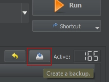

# Final Steps 

---

## Load Order

This section ensures that your load order is correct for the guide by overwriting
MO2's `loadorder.txt` file. It's fine if you skipped any number of mods in the guide;
this process will still work.

Click the  button at the top of MO2 and select <button>Open Profile Folder</button>. Double-click `loadorder.txt` to open it in your text editor of choice and **replace** any existing contents with the following:

```txt title="C:\Users<YOUR USERNAME>\AppData\Local\ModOrganizer\TTW\profiles\Default\loadorder.txt"
# This file was automatically generated by Mod Organizer.
# ╔═════════════ Wasteland Survival Guide Load Order ══════════════╗
# ║ This is a file for MO2 to parse automatically; you don't need  ║
# ║ to read or edit it. Many listed mods are NOT part of the guide ║
# ║ and are only here as contingencies. Please ignore them!        ║
# ╚════════════════════════════════════════════════════════════════╝
FalloutNV.esm
DeadMoney.esm
HonestHearts.esm
OldWorldBlues.esm
LonesomeRoad.esm
GunRunnersArsenal.esm
Fallout3.esm
Anchorage.esm
ThePitt.esm
BrokenSteel.esm
PointLookout.esm
Zeta.esm
CaravanPack.esm
ClassicPack.esm
MercenaryPack.esm
TribalPack.esm
TaleOfTwoWastelands.esm
YUPTTW.esm
Mr House Final Battle Hotfix.esm
Restored Physics Sounds.esm
Placement Fixes.esm
PerformanceOfTheTitans.esm
NavmeshOverhaul.esm
FO3_Optimization.esm
Main And Pause Menus Overhaul.esm
BiRepChecks.esm
TTW - Capital Wasteland Adjustments.esm
Repeatable Quests Rewards Rebalanced.esm
Functional Post Game Ending Lite.esm
Functional Post Game Ending Lite TTW Patch.esm
3DNPCFNVBundle.esm
Lived-In New Vegas.esm
Lived-In Strip.esm
ExtraGoodies.esp
Goodies.esp
ExtraGoodies - TTW.esp
Goodies - TTW.esp
Mojave Scenery Overhaul.esm
Mojave Scenery Overhaul - TTW.esm
TGMIO.esm
TGDLCIO.esm
TGDCIO.esm
AWorldOfPainFO3.esm
A World of Pain Revised.esm
Sweet Pain.esm
Sweet Pain NV.esm
MoreMojave.esm
Mojave Scenery Overhaul - A World of Less Pain Patch.esm
TLD_Travelers.esm
Mojave Scenery Overhaul - TLD Patch.esm
Faction Wasteland Presence.esm
Mojave Raiders Lite.esm
Mojave Raiders Lite - TTW Patch.esm
Mojave Wildlife (FO3-Style + No Chanced).esp
Mojave Wildlife - TTW Patch.esm
SD_Transporters.esp
Home and Safehouse Tweaks.esm
mil.esp
mil-TTWPlacements.esp
mil_Add-On.esp
Tactapack.esp
ZL_Armaments_Remastered.esm
zlArms3DNPCsPatch.esp
TTW Dialogue and Interactions Expansion Overhaul.esp
TLD_Travelers - TTW Patch.esm
FNV_Optimization.esm
FNV_Optimization YUPTTW.esm
ATMOS Ambient Overhaul.esp
TTW FaceGen Fix.esp
TTW No PipBoy Glove Equipping or Race Changes.esp
The Mod Configuration Menu.esp
AmmoScriptFixes.esp
CriticalEffectFixes.esp
GasTrapPerformanceFix.esp
Vanilla UI Plus.esp
JustAssortedMods.esp
JBTImproved.esp
JIP Companions Command & Control.esp
Stash Organizer.esp
QuickSelect.esp
TTW Quick Start.esp
TTW Quick Start Item Remover.esp
Wasteland Starting Gear DC.esp
TTW No Free Levelup Quick Start.esp
TTW Quick NV Train Start.esp
DelayDLCRedux.esp
DelayDLCReduxPOPP.esp
TTWTransportalponderEx.esp
SD_Transporters spelling.esp
Benny Humbles You and Steals Your Stuff.esp
TLD LVLI Total Overhaul.esp
SP TTW Patch.esp
TGMIO_TLD_Patch.esp
MoreMojave DSE- Mojave Scenery Patch.esp
WeaponRequirementSystem.esp
Reload Reloaded.esp
RAD.esp
Quickthrow.esp
QuickthrowTweaks.esp
Supplemental Ammo Crafting.esp
TTWPerkOverhaul.esp
DIEO - AWOPFO3 Patch.esp
Famine.esp
Famine - Flora.esp
Famine - Flora TTW.esp
GRA Scavenger Hunt Unbalanced.esp
Simple Attack Reactions - NV+TTW.esp
MigPowerAttack.esp
SMAC - Simple Melee Attack Cancel and Parry.esp
Hitstop.esp
Enhanced Movement.esp
WTH AMR Fix.esp
Kyu_Ballistics_TTW.esp
BulletTrails.esp
AWSOMER.esp
ATMOS NV - TTW Patch.esp
ATMOS Ambient Overhaul - DLC.esp
ATMOS Ambient Overhaul - AWOP Revision.esp
ATMOS Sound Overhaul - TTW.esp
Atmospheric Lighting Tweaks TTW.esp
ATMOS - Atmospheric Lighting Tweaks Patch.esp
Wasted LOD rocks.esp
TTW Fallout 3 LOD.esp
VNV LOD Plugins.esp
DNWeathers.esp
Interior Rain.esp
Interior Rain - TTW.esp
CC - Rain.esp
CC - 3D Rain.esp
```

Press F5 to refresh MO2 and if everything went correctly, the list of plugins in the right pane will be reordered. If you installed all of the mods in the guide then the final plugin should be `CC - 3D Rain.esp`, however if you opted to skip some mods then it may be something else. This is fine, as long as you saw the list of plugins being reordered after refreshing.

## Mod List Order
```txt title="C:\Users<YOUR USERNAME>\AppData\Local\ModOrganizer\TTW\profiles\Default\modlist.txt"
+WSG Terrain LOD
+WSG Object LOD
+VNV LOD Guide Plugins Merge
+Nuclear Trees - Vanilla
+Nuclear Core
+Physically Based LOD
+TTW Fallout 3 LOD
+Decent LOD Kit
+LODIFY FNV Wall_SoGB Editon
+LODIFY
+Different LOD mods little tweaks and additions
+Wasted LOD - Cliffs of DC
+RubbleBlockade LOD Fixed
+Wasted LOD - Cliffs of Mojave
+More LODs Additions and fixes
+TCM's LOD Overhaul
+Optional Overpasses
+FNV LOD Supplementation
+LODadditions
+Much Needed LOD fixed rocks color
+Much Needed LOD
+LOD_separator
+Climate Control - 3D Rain
+Climate Control - Rain
+3D Rain
+Interior Rain - TTW
+Interior Rain
+Cloud Upgrade
+NillaPlus Majestic Moon (medium) 1K
+Accurate Stars - Mothership Zeta Patch
+Accurate Stars
+Desert Natural Weathers TTW
+Longer Weather Transitions ESPLess
+MoonlightNVSE
+ATMOS - Atmospheric Lighting Tweaks Patch
+Atmospheric Lighting Tweaks - TTW
+Vanilla Plus Tonemapper - Sky Brightness Tweak
+Vanilla Plus Tonemapper
+Vanilla Plus Terrain
+Tactapack - AWSOMER Patch
+Another Millenia Gun-Addon - AWSOMER Patch
+Another Millenia - AWSOMER Patch
+AWSOMER
+Subtle Rifle Equip Sound
+Weapon Iron Sights Foley - Espless
+PhySFX
+Restored Physics Sounds
+ATMOS NV - TTW Patch
+ATMOS Ambience Overhaul - AWOP Revision
+ATMOS DLC Overhaul Part I
+ATMOS Ambience Overhaul - Master - Hi-Fi
+ATMOS Ambient Sound Overhaul - TTW Updated .esp
+Bullet Trails
+Kyu's Ballistics Fixed - TTW
+Weapon Retexture from EVE
+aWRP - Scripts (TTW)
+WTH - AMR for TTW
+WTH - AMR Suppressor Fix
+TTW's Hunting Rifle and .32 Rifle Textures
+WTH - Weapon Textures from Heaven 2k
+aWRP - NVAO-Guns Patch
+aWRP - Resource
+PSRO - Mod Compatibility Compendium - FOMOD
+PSRO - Peripheral Scope Reticle Overhaul
+Scope Aim Tweaks (No Plugin)
+NVCS Vanilla Weights
+kNVSE Fixpack
+Iron Sights Aligned - Mod Support
+Iron Sights Aligned
+Enhanced Locomotion
+Hit - Millenia Animations - Part 2
+New Vegas Animation Overhaul - Throwverhaul
+New Vegas Animation Overhaul - Melee
+Various Hotfixes
+New Vegas Animation overhaul - Guns
+Anniversary Anim Pack
+B42 Dynamic Pip-Boy
+B42 Inertia
+HIPControl
+Weapon Based Hands Clip Distance
+Assorted UI Textures
+ISControl
+3rd Person Animation Fixpack
+Simply Upscaled Grass - Vanilla Style - 2k
+Mobile Pip-Boy Light
+High Resolution Water Fog
+High Resolution Bloom
+Contrasted LOD Noise 2k
+Aesthetics & Ambience_separator
+TTW Perk Overhaul - ZL Armaments Remastered Patch
+TTW Perk Overhaul - Tactapack Patch
+TTW Perk Overhaul - Another Millenia Add-on Patch
+TTW Perk Overhaul - Another Millenia Patch
+TTW Perk and Consumables Overhaul - BiRepChecks
+Harder Barter Faster Stronger
+RAD Fixed Plugin TTW
+RAD - Overhaul
+TTW Fix Famine Raven Rock
+Famine Exception Patches
+Famine - Flora TTW Patch
+Famine
+Overhauls_separator
+ZL Armaments Remastered And FNV 3DNPC Patch
+ZL Armaments Remastered
+Improved AK-112 Mesh
+Tactapack
+Another Millenia Gun Add-on
+Another Millenia - TTW Unique Placements
+Update 2.7a
+Another Millenia
+GRA UWR Unbalanced
+DIEO - AWOPFO3 Patch
+The Living Desert - TTW Patch
+Mojave Wildlife - TTW Patch
+Mojave Raiders Lite - TTW Patch
+Mojave Wildlife - FO3 No Chanced Spawns Version
+Mojave Raiders Lite
+Faction Wasteland Presence
+FNV 3DNPC Bundle Updated TTW All In One Plugin
+FNV 3DNPC Bundle Updated All In One Plugin
+MoreMojave DSE - Mojave Scenery Patch
+More Mojave Dark Side Edition
+TTW Patch (Sweet Pain NV)
+Sweet Pain NV
+AWOP Revised
+Sweet Pain DC
+A World of Pain for Fallout 3
+The Great DC Interior Overhaul
+The Great DLC Interior Overhaul
+The Great Mojave Interior Overhaul
+Lived-In Strip
+Lived-In New Vegas
+Mojave Scenery Overhaul
+TLD Leveled List Overhaul
+Optional - Extra Goodies - TTW
+Main - Goodies - TTW
+Goodies - Custom INI
+Goodies
+The Living Desert .ini
+The Living Desert Main File
+Functional Post Game Ending Lite
+Content_separator
+Simple Attack Reactions - TTW - AIO
+lStewieAl - Cookable Grenades
+B42 Quickthrow Tweaks - Give player perks method
+B42 Quickthrow
+SMAC - Simple Melee Attack Cancelling and Parry
+Power Attack Tweaks
+Sweet Accuracy Preset
+Accuracy Manager (NVSE)
+B42 True Leaning - Custom INI
+B42 True Leaning
+B42 Recoil
+B42 FireMode
+Reload Reloaded
+Weapon Requirements System - Custom INI
+Weapon Requirements System
+Combat_separator
+Enhanced Movement - WSG
+Enhanced Movement
+NPCs Sprint kNVSE - ESPless
+SD_Transporters Spelling Patch
+Transporters - Fast Travel Alternative
+TTW Transportalponder Extended
+Better Damage Multipliers
+Repeatable Quests Rewards Rebalanced
+Flak N Shrapnel Expansion
+Craterside Supply Expansion
+Better Caravan
+Modern Night Vision - INI
+Modern Night Vision
+Bottle the Water
+Home and Safehouse Tweaks
+Stash Organizer INI
+Stash Organizer
+Supplemental Ammo Crafting
+Perk Styled CCC Icons
+Jip CCC HD Icons
+JIP Companions Command and Control
+JIP LN Custom INI
+JAM - Custom INI
+JBT Improved 2.0
+Clean Just Assorted Mods
+Just Assorted Mods
+BHYSYS
+Quick Train
+TTW No Free Levelup Quick Start
+Wasteland Starting Gear DC
+TTW Quick Start Item Remover
+TTWQuickStart
+TTW - Capital Wasteland Adjustments
+Delay DLC Redux TTW - Pre-Order Pack Placement
+Delay DLC Redux TTW
+TTW BiReputationChecks
+Gameplay_separator
+Faster Pipboy
+Local Map Overhaul
+Pip-Boy UI Tweaks - INI
+Pip-Boy UI Tweaks
+True Colorful Map Marker Icons
+Simple Maps - TTW - Compressed
+Simple Maps - TTW
+TTW Goodies
+Consistent Pip-Boy Icons v5 - Dynamicon
+Stats (And Some Perks)
+Consistent Pip-Boy Icons v5 - Reputation
+Consistent Pip-Boy Icons v5 - Addendumb
+Consistent Pip-Boy Icons v5 - Vault Girl Extension
+Consistent Pip-Boy Icons v5 - Extension
+Consistent Pip-Boy Icons v5 - DLC's Items
+Consistent Pip-Boy Icons v5 - Apparel
+Consistent Pip-Boy Icons v5 - Weapons
+Consistent Pip-Boy Icons v5 - Items
+Consistent Pip-boy Icons
+Map Marker Icons
+Weapon Hotkey Icons
+Pop-Up Message Icons
+Consistent Pip-Boy Icons v5 - Framework Plugin
+Vault Boy Paper Doll
+High Resolution Screens
+Condition Meter Icons
+ySI - Contextual Prompts
+Colorful Icons Support
+Color Inventory Ycons
+ySI Vanilla MiscQuest Items Patch
+Exit Categories with Tab
+ySI - Assorted Fixes
+ySI - Sorting Icons
+yUI - Custom INI
+yUI
+ESP-less Tutorial Killer
+Character Build Presets
+Character Preset Menu
+Clean Companion Wheel 256x256 Edition
+Sleep Wait Hardcore Needs
+Modern Minimap - Custom INI
+Modern Minimap
+High Res Local Maps
+B42 Notify
+Quick Select - Custom INI
+Quick Select
+Main Menu Redone - TTW - AIO
+Radiation Loadwheel
+Scum's Considerably Cute Corner Load Wheel (Vanilla)
+MAPMO WSG Preset
+Extras - Stewie's Tweaks Sorting Icons Replacer
+Extras - Hi-Res Logos
+Main And Pause Menus Overhaul
+Vanilla Fonts Revisited
+Clean Vanilla Hud
+Vanilla UI Plus (New Vegas)
+MCM Extender
+The Mod Configuration Menu
+User Interface & HUD_separator
+Fallout 3 Interior Optimization Project
+New Vegas Interior Optimization Project
+Fog-based Object Culling
+Female Pipboy Fixed - Ultimate Edition
+PipBoyOn Node Fixes TTW
+Performance Of The Titans
+Items Transformed - Enhanced Meshes (ITEM)
+MAC-TEN TTW
+MAC-10
+Navmesh Overhaul
+Optimizations_separator
+Slideshow FOV Fix
+Consistent Weapon Mod Descriptions
+Gas Trap Performance Fix
+Vanilla Placement Fixes TTW
+FaceGen Tint Fixes for TTW
+Equip and Movement Speed Fix
+Critical and Effects - Fixes and Tweaks
+Ammo Script Fixes
+ConsistentSpreadv1.3
+Viewmodel Shake Fix - NVSE
+Viewmodel Shading Fix - NVSE
+Muzzle Flash Light Fix
+Depth Resolve - NVSE
+LOD Flicker Fix - NVSE
+LOD Fixes and Improvements - INI
+LOD Fixes and Improvements - NVSE
+Fallout Alpha Rendering Tweaks
+Exterior Emittance Fix
+Depth of Field Fix
+Blood Decal Flashing Fix
+Audio Region Fix - NVSE
+Smooth True Ironsights
+Save Manager
+Faster Sleep Wait
+Faster Start Menu
+Stewies Tweaks - Custom INI
+Climate Control NVSE
+KEYWORDS
+Shader Loader - NVSE
+Cell Offset Generator - NVSE
+zlib Updated - NVSE
+SUP NVSE Plugin
+AnhNVSE
+Extra Utilities & Fixes_separator
+OneTweak
+Performance Guide_separator
+Console Paste
+Improved Console
+Crash Logger
+MLF
+UIO - User Interface Organizer
+kNVSE
+ActorCause Save Bloat Fix
+VATS Lag Fix
+Fast Weapon Lag Fix
+Engine Optimizations
+Stewie Tweaks
+NVTF - INI
+NVTF
+ShowOff INI
+ShowOff xNVSE
+All Tweaks Preset
+JohnnyGuitar NVSE
+JIP LN NVSE Plugin
+TTW NVSE Plugin
+Utilities_separator
+YUPTTW 13.7.1
+Tale of Two Wastelands
+TTW_separator
```

Press F5 to refresh MO2 and if everything went correctly, the list of Mods in the left pane will be reordered. If you installed all of the mods in the guide then the final mod should be `+Tales Of Two Wastelands`

Click the <button>**Create a Backup**</button> buttons so if something ever goes wrong you can instantly restore this load order and modlist:



# Finishing Notes

Congratulations! You now have a modded Tale of Two Wastelands setup to enjoy. For additional resources such as incompatible mods, performance tips, frequently asked questions and more, see the [Appendix](appendix). Join the [TTW Discord](https://discord.gg/taleoftwowastelands) if you have any additional questions about the guide, modding, or just to chill.

# Additional Mods

Check out our [Additions](additions) page for mods approved and recommended by our team that did not make it into the guide for one reason or another. Unfortunately, we do not have the time or energy to provide support for setups that install extra mods on top of the guide. We cannot stress enough that it is only recommended to add your own mods if you are an experienced modder and know how to manually make conflict resolution patches and sort your load order! If you don't know [how to do that](https://moddinglinked.com/themethod.html) in [xEdit](https://moddinglinked.com/xedit.html), or you are unwilling to spend the time to do so, it is not recommended to add your own mods. You can't just throw a bunch of mods on top of the guide without doing any conflict resolution, or use automated tools like LOOT as a substitute for proper conflict resolution, and expect your game to function as intended. Once again, **we will not support setups that have added any mods**.
