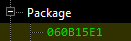
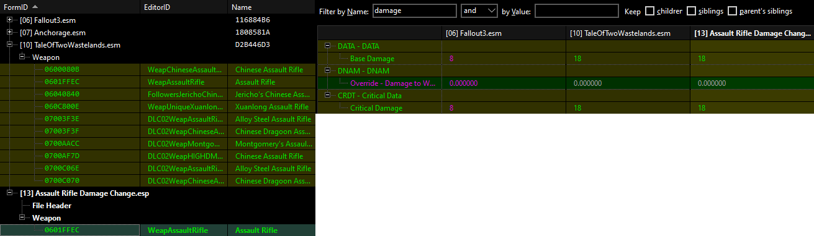

# xEdit: The Basics
---

## Introduction and Terminology

xEdit is a tool you can use to edit plugins and have a visual representation of how the edits overlap with the base game or other mods. This allows you to compare changes and easily do things such as patching, understanding what a mod does, changing things about the mods or the vanilla game and more. The basic rule of how plugins work is that only the latest instance of a record gets loaded (there are a few exceptions to that, such as NAVI or Previous INFO, but you do not need to worry about them for now).

These are some of the terms you'll need to know:
- Override: Taking an existing record in a plugin and then editing it in another plugin.
- Conflict: These happen once you start adding >=2 unique edits to that record (so for example you have the original record in vanilla, then a mod changing it, then another mod editing it to something different from the previous 2). xEdit will represent these conflicts based on their type and with different colors both for the background of that record and for the text (Theres a legend for this).

:::info
The colors of a record do **NOT** indicate whether you need to act or not, it's simply a classification of the type of conflict. Green does not mean good and red does not mean bad.
:::

- Forwarding: If you want a change in a specific plugin to also be contained in another plugin, then you can drag that value or container of values into the other plugin. For example if a mod does not include a fix from the unofficial patch but it edits that record elsewhere, you can forward the fix and have both changes at once. Generally it is not recommended to forward or edit things directly in the mod plugins, you should always override into a new plugin that acts as a patch.

## Setup

1. Download the program. I use 4.0.4c, available in the [xEdit Discord server](https://discord.gg/5t8RnNQ). 4.0.4 on the game's Nexus page is fine.
2. Extract the archive and place the files inside a folder of your choosing. Do **NOT** place it inside a system folder nor the game folder. Mod Organizer 2 by default will create a folder in your C drive called Modding, that is a good place for all your tools.
3. Add xEdit to MO2 by pressing CTRL + E and `Add from file...`, then point it to the xEdit executable you placed in your modding folder before.
5. If you downloaded xEdit from the Discord server then you will need to add **"-FNV"** as command line argument for it to start in the right game mode. This is not required if you downloaded the tool from the game's Nexus or if you renamed the executable file to FNVEdit.exe.
4. Run the program.

:::caution
Do not use the x64 executable. It will introduce rounding errors, it only becomes required with huge amounts data being loaded (very unlikely on FNV) or very long sessions.
:::

## Plugin Structure

Any plugin will be loaded by the game as long as it is properly structured (created by tools such as xEdit or GECK) and if its extension is "ESP" or "ESM". The basic content of a plugin is its own header, which defines info such as the version of that plugin (has to match what the game uses for proper functionality, this is especially important if you want to port a mod from Fallout 3 to FNV/TTW). There is also information more important to an editor such as the author, description of that plugin, the number of records it contains (any record, even overrides) and the flags assigned to the plugin (you'll mostly see "ESM" here).

:::info
Remember that for a plugin to be an ESM, it is almost always preferable to only flag it as such in the header. Changing extension to ESM is just an alternative that will **always** force the ESM flag on runtime, this means that in order to get rid of the flag from a plugin with the ESM extension, you'd break any other mods that have such plugin in their masterlist (since the removal involves renaming the plugin).
:::

You can view plugins as a list of objects in unique containers that specify which type of content is inside. For example a weapon record will be contained under the `Weapons category`. Each of these objects has it's own ID called FormID written in [HEX](https://en.wikipedia.org/wiki/Hexadecimal) which makes it unique, but there is also an **EditorID** which the game ignores and you can use for easier identification or filtering. Going back to the weapon example, you can have the weapon itself with its **BaseID** or you can have instances of that weapon placed in the game world which are called references, so they each have their own **RefID**.

### FormIDs

A FormID is split in 2 parts, the **index** and the **ID**. The index (indicated by the first 2 digits of the FormID) is an indicator of where the plugin that record originates from is located in your load order. In the next picture, the record I expanded has the FormID `1200186D`, so that plugin is placed at index 12 and the record selected has the ID 186D. You can tell the record is unique not only by the index, but also the fact that it has no color, so it is completely unique to that plugin and no other plugin in the load order has changed it.

But if I select an override in that same plugin you will see a different index, since that record in
green was first created by the plugin that has index 06, which is `Fallout3.esm`.

You cannot patch or edit everything with xEdit. Records involving **navmeshes**, **scripts**, **quest stages**, and **terrain** all need to be modified through GECK since they rely on the render window, compilation, or specific functions.

## Example

Now let's say i want to edit something in the base game, such as the damage of the Assault Rifle. Let's also assume we don't know the ID of that weapon so we will first filter it using its name in xEdit.

1. Start by loading the base plugins for TTW.

1. Once everything has loaded (the tips will go away) you can start looking for that gun by using the xEdit filter, just right-click any plugin on the tree-view (that's the list on the left) and selecting "**Apply Filter**". This will open a menu with all sorts of criteria to filter by, but first you need to uncheck all the boxes it has selected by default, then we will proceed with our own custom filter that will find the weapon.

Now apply the filter and you will be presented will all the plugins that have created or overridden a record going by that name and record type you filtered. In this case the filter found multiple weapons, expand the last plugin (so that we can override the latest instance of that weapon, since TTW edits it and we don't want to lose those changes) and right-click the Assault Rifle, then select the "Copy as override into..." option. This will let you create a new plugin with a name of your choice where the damage change will happen.

To make a new plugin, select `**<new file>.esp**` in the prompt, then name it. Once created, you will see your plugin appear at the bottom of the tree-view and a new override appearing in the record you opened in the right pane. Let's also filter for "damage" on the top left of the right pane, so that we can see where damage is defined in that record.

Now you can just edit that number (Right-click, edit) in your plugin. The plugin that are you changing is dictated by the column you choose to edit values in. Once you are done, just close xEdit and it will ask you to save. When you are back in Mod Organizer 2, you will find a new plugin in your overwrite folder, which is the plugin you just created.
